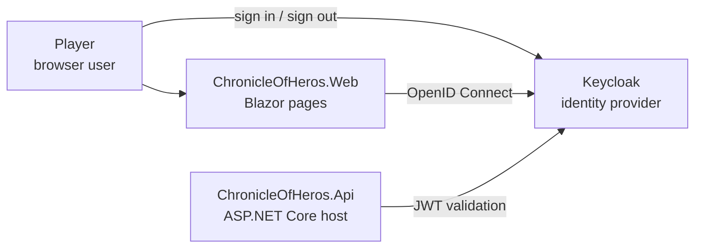

# System: context

Scope: who uses ChronicleOfHeros and which runtime parts and external systems exist today.
Load when: orienting in the system; changing actors, browser entry points, or external dependencies.
Parent: [ARCHITECTURE.md](../../../ARCHITECTURE.md) · Neighbours: [deployment.md](deployment.md), [../solution/projects.md](../solution/projects.md)

```mermaid
flowchart LR
    player["Player<br/>browser user"]
    web["ChronicleOfHeros.Web<br/>Blazor pages"]
    api["ChronicleOfHeros.Api<br/>ASP.NET Core host"]
    keycloak["Keycloak<br/>identity provider"]
    player --> web
    player -->|"sign in / sign out"| keycloak
    web -->|"OpenID Connect"| keycloak
    api -->|"JWT validation"| keycloak
```

- **Player** is a human who uses the browser to manage character data. They sign in and out through Keycloak; the Web header shows who is signed in.
- **Web** is the only application host meant for browsers. It renders the Blazor pages, holds the sign-in cookie, and currently makes no API calls.
- **Keycloak** (realm `chronicleofheroes`, backed by the `keycloakdb` PostgreSQL database) authenticates users. Browsers reach its login and logout pages directly during the OpenID Connect redirects.
- **API** currently exposes only the shared Development health endpoints; it validates Keycloak bearer tokens but has no protected or data operations.
- No application database or migrations host is currently provisioned.
- [Aspire AppHost](deployment.md) orchestrates the runtime parts for local development; no production deployment target is defined.

## Known deviations

- The API no longer implements the ASP.NET Core Identity/JWT design recorded in [ADR 0006](../../adr/0006-identity-backed-jwt-authentication.md); Keycloak is the identity provider. Tracking: #96.
- The PostgreSQL datastore selected by [ADR 0002](../../adr/0002-postgresql-as-the-datastore.md) is provisioned only for Keycloak; the application has no database, relational model, or migration host yet. Tracking: #84.
