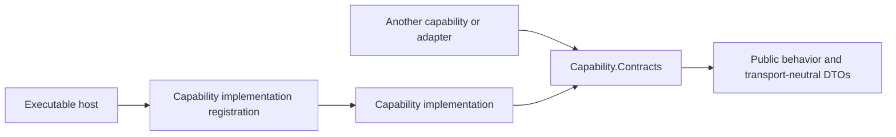
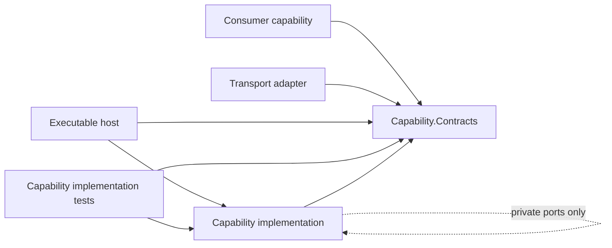
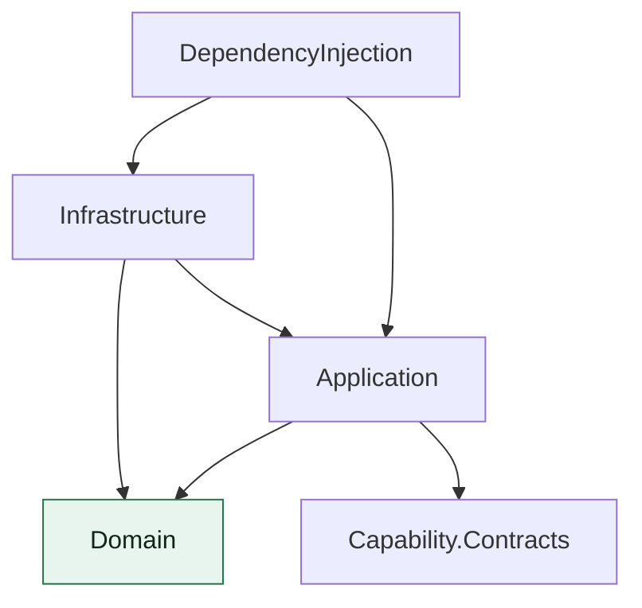
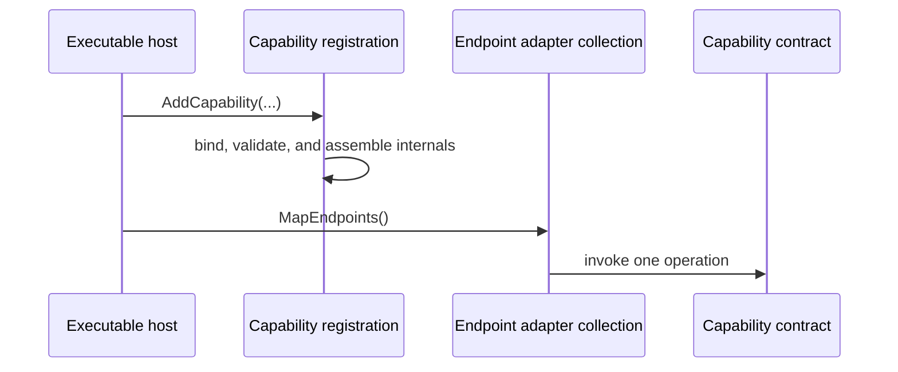
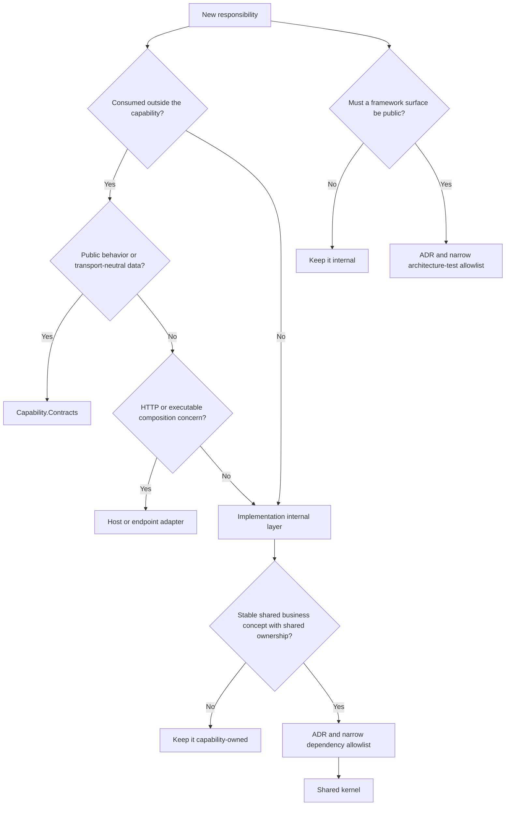

# Contract-first capability architecture

This guide defines how to place and compose a product capability. The names below are placeholders, not a prescribed snapshot of any current project layout.

## Core principles

- A capability is a cohesive product concern that independently exposes behavior to a host or another capability.
- Every capability has exactly one public contracts project and one implementation project.
- Contracts contain only public interfaces and transport-neutral request and response DTOs. Organize them by public responsibility: a service boundary and the requests/responses it owns belong together, while cross-boundary operation results remain in their own contract. They do not expose concrete implementations, persistence entities, database contexts, framework option types, or framework identity types.
- A capability owns its domain concepts even when those concepts are persisted.
- Contracts remain unversioned while every consumer is inside the pre-release solution. Introduce versioning only when an independently deployed external consumer requires it.

## Allowed references

- Consumers may reference only another capability's contracts project.
- An executable host and the implementation's own test project may reference the implementation only to invoke its public registration API.
- A host calls exactly one registration method for each installed capability. Configuration alternatives belong in an `Action<TOptions>` parameter on that registration API. The caller invokes an explicit option method inside the action, such as `options => options.EnableMigrations()`.
- Every service-registration configuration callback calls an explicitly named member on its options object. Registration owns configuration binding and validation. Required invalid configuration fails during startup, and raw configuration or an implementation service graph does not become an informal public API.
- Changes to project references are architectural changes. Update architecture tests and explain the boundary change in this guide or an ADR when it changes the long-lived decision.

## Implementation layers

- Keep `Domain`, `Application`, `Infrastructure`, and `DependencyInjection` inside the implementation project.
- `Domain` depends on neither frameworks nor another internal layer.
- `Application` depends only on `Domain`, the public contracts, and private ports that it owns.
- `Infrastructure` implements private ports and contains persistence and framework integrations.
- `DependencyInjection` is the only internal layer that assembles the capability.
- Concrete implementations and private ports stay internal. Do not use `InternalsVisibleTo` to turn internals into a testing interface. Prefer MSBuild properties or items over source assembly attributes when the build needs assembly metadata or visibility configuration.

## C# extension conventions

- Extension containers represent adapter behavior and use an `Extensions` suffix. Services represent runtime behavior and do not use that suffix.
- Declare extension methods and extension members with C# 14 `extension(...)` blocks. Do not add legacy `this` extension parameters.

## Host and endpoint composition

- Hosts are composition and transport adapters. Entry points perform host configuration, one registration call per installed capability, and endpoint composition only.
- Each endpoint adapter owns exactly one HTTP route-and-method operation. It owns transport concerns such as authorization, request binding, and response mapping; it depends only on capability contracts.
- Register and map endpoint adapters explicitly through dependency injection. Do not use reflection scanning for endpoint discovery.
- A migrations host enables schema migration through the capability registration options action. Normal application and distributed-application startup never execute migrations.

## Testing

- The primary behavior seam is a capability's public contracts plus its registration call. Implementation contract tests enter through that registration call, resolve only public contract interfaces, and assert observable behavior using contract DTOs.
- Use PostgreSQL through Testcontainers for relational behavior. Apply the capability's migrations through its migration registration option before constructing the runtime registration. EF Core InMemory and SQLite are not relational test substitutes.
- Use distributed-application tests for cross-host behavior such as gateway, browser, health, and end-to-end authentication flows.
- Architecture tests are build-breaking. They verify references, public surfaces, layer direction, composition roots, and endpoint rules; review remains responsible for cohesion and SRP judgment.

## EF Core model conventions

- Every concrete `DbContext` overrides `OnModelCreating` and explicitly applies every entity configuration it owns.
- Put each entity mapping in a separate `IEntityTypeConfiguration<TEntity>` type. Apply known configurations directly from `OnModelCreating`; do not scan an assembly for configurations.
- A capability owns the context, entities, configurations, and migrations for the relational data it owns.

## Placement decisions and exceptions

- Do not create a shared kernel because a type is persisted, convenient, or similarly named across capabilities. It requires a stable cross-capability business concept with genuine shared ownership, an ADR, and a narrow dependency allowlist.
- Framework-surface exceptions require an ADR and a narrow allowlist in the architecture tests. The exception documents why the surface cannot remain internal and which consumers may use it.
- Public implementation surface is limited to the registration API, narrowly necessary composition configuration types, unavoidable framework-convention types approved through the exception process, and the contracts project surface.
- Existing technical decisions remain in force: Aspire controls distributed orchestration, PostgreSQL remains the datastore, the Web host remains the same-origin API gateway, Blazor render-mode and localization decisions remain separate, and capability boundaries do not weaken established security behavior.